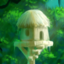
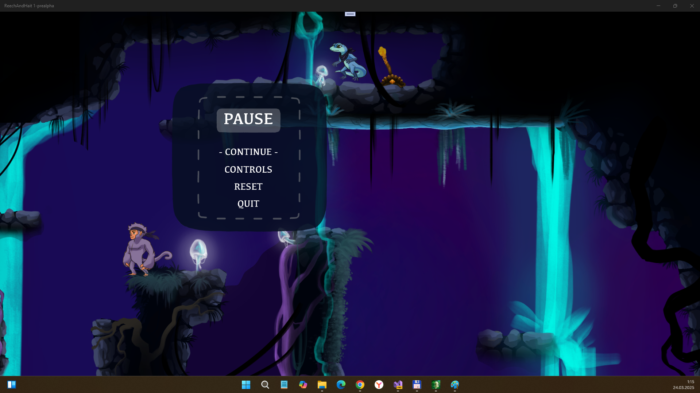
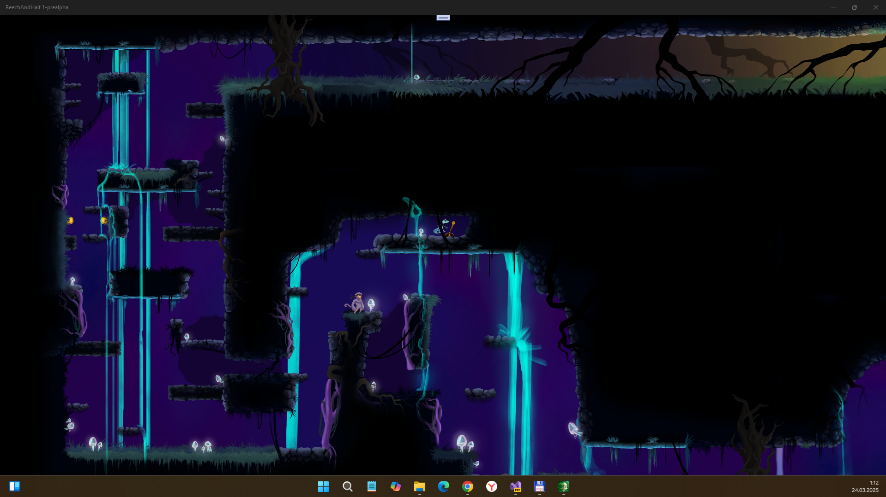
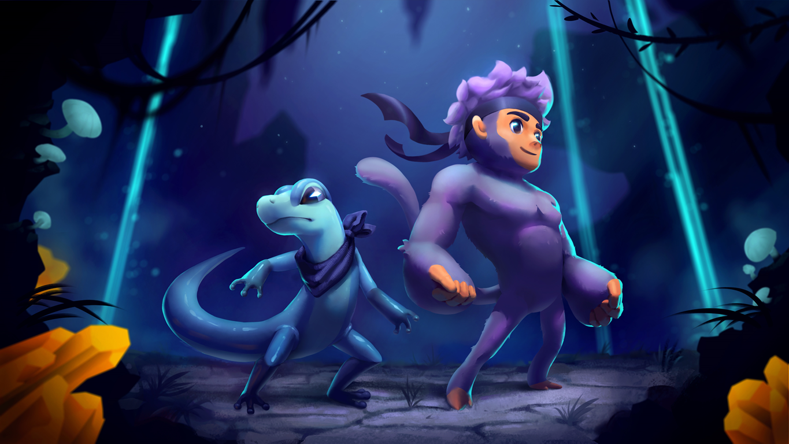

# ReechAndHait 1.0-pre-alpha - main branch 

"UWP-Remake" of ITCH.io ReechAndHait game project.

## About
"…tells the adventure of two friends,
Reech the gecko, and Hait the monkey, 
trying to find their way to a new home.

On their quest, they will encounter strange ancient mechanisms in 
a long-forgotten cavern and must combine their unique strengths to solve riddles.

This game is an atmospheric puzzle-platformer for two players in which you have to work together to help the duo find their way out!"

## Screenshots

## Tech details
- UWP app
- Min Win. SDK is 10240, Main Win. SDK is 14393  
- Input: Keyboard (Up/Down/Left/Right/Space) & "Emulated" XBox 360 Controller (W/A/S/D/X), and B/R/H/F, and Mouse :)
- Work in progress (no touch control & Monkey Bot AI)

## ToDo
- Realize Touchscreen support (for W10M / Lumia 950 or some cool Touch-friendly Win-tablet) 
- Dream on Monkey AI Bot (for duo-player mode game simplify ))
- Extend game worlds (puzzles, levels, stages, etc.)
- Optimize COntent size (at now it's size is so huuuuge, over 3.8 Gb!!!!!)

## How to build
1. Original project needed to download. Use this page: https://the-pigeon-protocol.itch.io/reech-and-hait

Download zip archive, and extract & copy all content (or only one-two level/stage data, to optimize disk space) from original Content folder to Content folder of this src...

2. Choose target x86, x64, or ARM, or ARM64, and build app. Or deploy appx package for your own game mechanics exploration .

## .
As is. No support. DIY. Learn purposes only.

## Reference(s)
- https://the-pigeon-protocol.itch.io/reech-and-hait Original project
- https://the-pigeon-protocol.itch.io/reech-and-hait/devlog/215324/finally-its-out Devlogs (original)
- https://www.youtube.com/watch?v=DyRcQ1VI6Bo | Reech and Hait | Game trailer (30s)
- https://www.youtube.com/watch?v=ezgt-a861r4 Reech and Hait | Gameplay  (30s)

## ..
[m][e] March 2025

